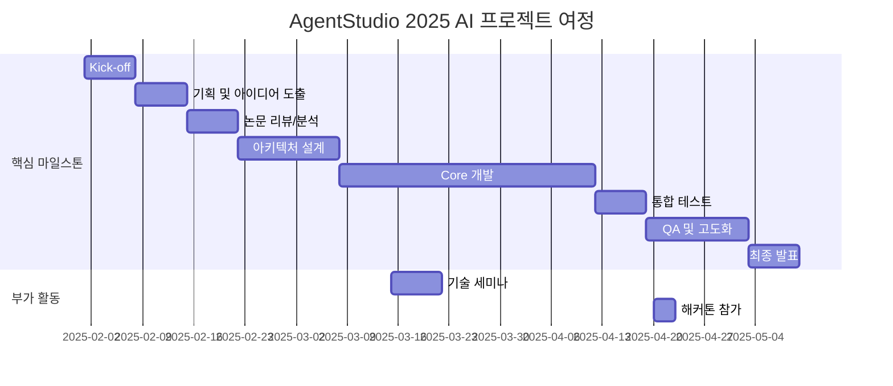

# 🔨 AgentStudio

<h1 align="center"> AgentStudio </h1>

<div align="center">
<a href="https://pseudo-lab.com"></a>
<a href="https://discord.gg/EPurkHVtp2"></a>
<a href="https://github.com/Pseudo-Lab/10th-template/stargazers"></a>
<a href="https://github.com/Pseudo-Lab/10th-template/network/members"></a>
<a href="https://github.com/Pseudo-Lab/10th-template/pulls"></a>
<a href="https://github.com/Pseudo-Lab/10th-template/issues"></a>
<a href="https://github.com/Pseudo-Lab/10th-template/graphs/contributors"></a>
<a href="https://hits.seeyoufarm.com"></a>
</div>
<br>

> 🔨 AgentStudio
> "함께 만드는 우연한 혁명(Serendipity Revolution)"  
> 진실함과 신뢰를 바탕으로 AI/DS 혁신 커뮤니티와 기술 실험을 진행합니다.

---

## 👥 역동적인 팀 소개 (Dynamic Team)

| 역할 | 이름 | 소속 | 기술 스택 배지 | 주요 관심 분야 |
|------|------|-------|--------------|--------------|
| **Project Manager** | 김재현 | kt ds |   | Agent 개발 및 AI PoC |
| **Member** | 모집중 | 가짜연구소 |   | AI Agent Architecture |

---

## 🌟 프로젝트 목표 (Project Vision)
_"이론에서 실전까지, 함께 성장하는 AI Agent 실험실"_  

- LangGraph 기반 멀티 에이전트 아키텍처 설계 및 구현  
- 매주 Agent 관련 논문·기술 학습 및 실전 적용  
- 12주간 완성도 높은 Agent 프로덕트 제작  
- 기획 → Core 개발 → Reflection → 개선 사이클  
- 최신 Agent 논문 리뷰 및 A/B 테스트  
- 실패 원인 탐구 및 개선 방법 제시  
- 바이브 코딩과 AI 툴 활용한 생산성 향상  
- 오픈소스 정신을 바탕으로 한 지식 공유 문화  

---

## 🧑 빌더 소개 (Builder)

- 안녕하세요, AI Service Engineer **김재현**입니다.  
- 현재 Agent 개발 및 AI PoC, Microsoft AI 기술을 지원하고 있습니다.  
- GitHub: [jh941213](https://github.com/jh941213)  
- Notion: [김재현](https://www.notion.so/800046740e6f48719d0092577bed089e?pvs=21)  

---

## 📝 모집 대상

> 💡 이런 변화를 원한다면 함께해요!
> 
> "나태해진 나에게 트리거를 주고싶은 분"

### 필수 요건:
- LLM, RAG, Agent 분야에 대한 기본 이해 (필수)
  - LangChain, AutoGen, LLamaIndex, openai agents, google, sdk, crewai 등 프레임워크 1개이상 설명가능 구현 가능한 정도
- 오프라인 참여가 가능하신 분 (최대한 오프라인 위주의 빠른 스프린트 진행 예정)
- 본인 자기계발을 위해 시간(평일저녁, 주말), 돈(리소스 비용) 투자 가능하신 분
- 다양한 방법론(Paper)과 SNS를 통해 신기술을 팔로업하고, 구현해보고 싶은 분

### ⏰ 활동 기간 및 모임
- 첫 모임: 날짜 / 시간 / 장소
- 정기 모임: 매주 토요일 오전 12시 (장소협의)  

---

## 👥 팀 소개

### 1. 스터디/프로젝트 내용
- 매주 Agent 관련 논문·기술 학습  
- 12주간 완성도 높은 프로덕트 제작  
- 기획 → Core 개발 → Reflection → 개선 사이클  

### 2. 목적
- 최신 Agent 논문 리뷰 및 A/B 테스트  
- 실패 원인 탐구 및 개선 방법 제시  
- 바이브 코딩과 AI 툴 활용한 생산성 향상  

### 3. 가설
- AI Agent 역량 체득 → 포트폴리오 강화  
- 리서치 중심 트렌디한 개발 경험  
- 바이브 코딩과 AI를 통한 생산성 상승과 새로운 개발 Cycle 학습  
- 1인 창업 가능한 수준의 역량 확보  

### 4. 주제 목표
- 하나 이상의 완성도 높은 프로덕트 제작  
- 컨퍼런스, 세미나 발표 및 GitHub 임팩트  
- 대회 참가 및 입상 목표  
  [K intelligence 해커톤 2025](https://dacon.io/competitions/official/236553/overview/schedule)  

---

## 🚀 프로젝트 로드맵 (Project Roadmap)


---

## 🛠️ 우리의 개발 문화 (Our Development Culture)

```python
class CollaborationFramework:
    def __init__(self):
        self.tools = {
            'communication': 'Discord',
            'version_control': 'GitHub Projects',
            'ci/cd': 'GitHub Actions',
            'docs': 'Github Wiki'
        }
    
    def workflow(self):
        return """주간 사이클:
        1️⃣ 월요일: 스프린트 플래닝 (Notion 타임라인 공유)
        2️⃣ 수요일: 코드 리뷰 세션 (Live Share)
        3️⃣ 금요일: 데모데이 (실제 적용 사례 발표)"""
```

---

## 👥 1인당 역할 분담 기준 가이드

| 유형 | 14주 기준 최소 책임 기준 |
|------|----------------------|
| **논문 리뷰** | 1인당 2~3편 (최신 Agent/LLM/RAG 관련 논문 리뷰/정리본/발표 필수) |
| **책 기반 스터디** | Agent 위주 책 (자율적) |
| **기술문서/블로그 번역** | 에이전트 개발시 적극 활용 |
| **콘텐츠/블로그 작성** | 자유롭게 작성 |
| **논문 구현** | 자유롭게 구현 |
| **Agent 개발** | 코어 기능/프롬프트 엔지니어링/인프라 중 1~2개 <br>ex): "프롬프트 설계", "API 래퍼 개발", "MCP 통합" |
| **AI 서비스 MVP 개발** | 1인당 핵심 기능 1~2개 <br>ex) UI/UX 1안, API 모듈, 데이터 파이프라인, 배포 자동화 |
| **테스트/QA** | 통합 QA 라운드 2회 이상 참여 (QA는 필수 참여) |

> ✍️ ***활용 팁**: 각 실험 목표와 역할 기준은 인원과 기간에 따라 빌더가 자연스럽게 조정 가능합니다.*

---

## 🔗 프로젝트 결과 & 공유

- 발표 자료, 학습 요약, 문제/발견/후기 노션 페이지 or GitHub Issue에 아카이빙
- 오픈 기록/후기/SNS 링크 등 외부 확산 증빙(선택)
- 회고/칭찬/감사/질문 모음 페이지 운영

---

## 💻 주차별 활동 계획 (Weekly Activity Plan)

> 매지컬 위크, 개발 일정에 따라 조금씩 상이할 수 있습니다. 기술(Paper) 발표 주간은 따로 Notice 후 진행합니다.

| **주차** | **담당자** | **주제/분량** | **발표/실험/리뷰 내용** | **결과물 유형** | **비고(가설, 실험 등)** |
|---------|-----------|-------------|-------------------|--------------|-------------------|
| 1주차 | 전원 | kick-off / 기획 | 아이스브레이킹 / 기획 | 노션, github 에 아이디어 정리 | "레퍼런스 참고 우리의방향은?" |
| 2주차 | 전원 | 기획 | 기획 아이디어 도출 | 노션, github 에 아이디어 정리 |  |
| 3주차 | 전원 | 분석 | 최신 Agent 논문 리뷰(2~3편), 아키텍처 벤치마킹 | 리뷰 발표, 정리 문서 | 구현 가능성/한계 분석 |
| 4주차 | 전원 | 설계 | 아키텍처 설계, 리소스/비용 산정 | Mermaid 다이어그램, 설계서 | MVP 범위 정의 |
| 5주차 | 전원 | 설계 | 모듈별 기능 분해, 담당자 배정, 개발환경 세팅 | 초기 개발환경 정리본 | Repo/CI/CD 세팅 |
| 6주차 | 전원 | 개발 | Agent Core 프로토타입 구현 | 코드 Repo, 테스트 결과 |  |
| 7주차 | 전원 | 개발 | RAG/Memory/프롬프팅/MCP 모듈 구현 및 통합 | 코드 Repo, 테스트 결과 |  |
| 8주차 | 전원 | 개발 | Interaction Layer(API/CLI/UI) 구현 | API 문서, Mockup Swagger/Postman |  |
| 9주차 | 전원 | 개발 | 통합 테스트 | 테스트 리포트, 개선안 (QA) | 실패 케이스 중심 피드백 |
| 10주차 | 전원 | 개발 | 최적화, A/B 테스트 (Prompt, Agent 구조) |  |  |
| 11주차 | 전원 | QA/고도화 | 통합된 기능 QA, 버그 수정 |  |  |
| 12주차 | 전원 | 배포 환경 구축 | Azure, Docker 셋팅 | 문서 정리 |  |
| 13주차 | 전원 | 실증 테스트 | 가짜연구소 또는 지인을 통한 실증테스트 | 테스트 피드백 정리 | 피드백 중심의 빠른 수정 반영 |
| 14주차 | 전원 | 최종 발표 및 회고 | 프로젝트 최종 발표, 개인별 회고 공유 | 발표자료, 회고록, 영상 Demo | 개인 성장 포인트 공유 |

---

## 💡 학습 자원 (Learning Resources)

**우리가 만든 지식 허브**

- [AgentStudio Core Repo](https://github.com/Pseudo-Lab/AgentStudio): Agent 서버, 멀티 에이전트, 데이터 파이프라인, 인프라
- [System Architecture Docs](https://github.com/Pseudo-Lab/AgentStudio/blob/main/README.md): 구성 요소 및 흐름도
- [Quick Start Guide](https://github.com/Pseudo-Lab/AgentStudio/blob/main/README.md): 개발 환경 설정 가이드
- LangGraph, AutoGen, Azure 등 공식 문서
- GitHub, tech blog, SNS 레퍼런스
- 에이전트 관련 책 (현재 책을 여러권 구매해놔서 같이 보면서 레거시를 익힙니다)

---

## 📚 학습 활동 및 운영 방식

### 학습/실험 진행 방법:

> 💡 오픈 아카데미 원칙: 모든 발표자료, 기록, 코드, 회고는 깃허브/노션/위키에 공개. 청강/질문/피드백 자유

1. **진행 및 발표**
   - 오프라인 미팅 (디스코드 배정된 Room 에서 회의, 방법론 등 발표) 청강가능
   - 최소 1인 2~3회 발표(인원 따라 조정)
   - 발표자료/정리본은 노션 또는 깃허브 Issue에 공유

2. **필수 학습/실험 활동**
   - 주차별 본인이 학습 / 실험 한 것에 대한 인증 작성
   - 최소 2개이상 X, LinkedIn 유용한 포스팅 공유
   - 질문 및 어려운 점 기록/공유 (빠르게 피드백이 될 수 있도록 채널통해 공유)

3. **실험/가설 검증**
   - 새롭게 시도하거나 검증해보고 싶은 주제/가설 명확히 제시 후 도전
   - ex) deep research 의 새로운 논문이 나오면 구현해봐도 무방 본인의 에이전트 일정에만 충실하다는 가정

---

## 🌱 참여 안내 (How to Engage)

- **빌더로 참여** — 프로젝트 기획·운영 주도
- **러너로 참여** — 연구·개발·테스트 등 실행  
- **청강 참여** — 공개 세션 참여 가능

❗️참여 링크: [가짜연구소 디스코드](https://discord.gg/EPurkHVtp2)
❗️커뮤니케이션 채널: 디스코드 #Room-GH

**누구나 청강을 통해 모임을 참여하실 수 있습니다.**

1. 특별한 신청 없이 정기 모임 시간에 맞추어 디스코드 #Room-GH 채널로 입장
2. Magical Week 중 행사에 참가  
3. Pseudo Lab 행사에서 만나기

---

## 🙏 Acknowledgement

이 프로젝트는 **가짜연구소 Open Academy**로 진행됩니다.
여러분의 참여와 기여가 '우연한 혁명(Serendipity Revolution)'을 가능하게 합니다. 모두에게 깊은 감사를 전합니다.

AgentStudio is developed as part of Pseudo-Lab's Open Research Initiative. Special thanks to our contributors and the open source community for their valuable insights and contributions.

---

## 👋 About Pseudo Lab

[Pseudo-Lab](https://pseudo-lab.com/)은 머신러닝과 AI 기술 발전을 위한 비영리 단체입니다.
핵심 가치: **Sharing, Motivation, Collaborative Joy**
5k+ 연구자가 참여하는 글로벌 커뮤니티로, 머신러닝과 AI 기술 발전에 기여하고 있습니다.

---

## 😃 Contributors

<a href="https://github.com/Pseudo-Lab/AgentStudio/graphs/contributors">
  
</a>

---

## 🗞 License

This project is licensed under the [MIT License](https://opensource.org/licenses/MIT).


