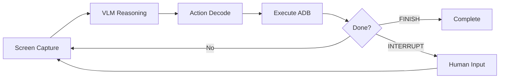

오픈소스 관례에 따라 **Gemini 3 모델 선택** 기능과 **Gemma 업데이트 로드맵**을 반영한 영문 `README.md` 전체 코드입니다.

---

# 🔨 README.md (English)

```markdown
# 🔨 AgentStudio

<div align="center">
  <a href="README.md"><b>English</b></a> | <a href="README_KR.md"><b>한국어</b></a>
</div>

<div align="center">
<a href="https://pseudo-lab.com"></a>
<a href="https://discord.gg/EPurkHVtp2"></a>
<a href="https://github.com/Pseudo-Lab/Agent_Studio/stargazers"></a>
<a href="https://github.com/Pseudo-Lab/Agent_Studio/network/members"></a>
<a href="https://github.com/Pseudo-Lab/Agent_Studio/pulls"></a>
<a href="https://github.com/Pseudo-Lab/Agent_Studio/issues"></a>
<a href="https://github.com/Pseudo-Lab/Agent_Studio/graphs/contributors"></a>
<a href="https://hits.seeyoufarm.com"></a>
</div>
<br>

> 🔨 **AgentStudio** - Pseudo-Lab 11th AI Agent Project  
> "Bridging the intergenerational knowledge gap with AI and sharing positive influence."

---

## 🤖 Kiosk Agent

> **Vision-Language-Action (VLA) Agent for Automated Kiosk Interaction**

Kiosk Agent is an AI system that utilizes Vision-Language Models (VLM) to automatically control Android kiosk applications. It interprets visual interfaces and executes precise actions to assist users.


### ✨ Features

- **Multi-Model Intelligence**: Powered by `gemini-3-flash` and `gemini-3-pro` for versatile reasoning.
- **VLA Paradigm**: Seamless workflow: Vision → Language → Action.
- **[AG-UI Protocol](https://github.com/ag-ui-protocol/ag-ui)**: Standardized agent-to-UI communication.
- **Human-in-the-Loop**: Asks the user for input when subjective choices are needed.
- **Planning Mode**: Decomposes complex requests into steps with real-time To-do tracking.
- **Voice Interface**: Native support for TTS (CosyVoice3) and STT (Google Cloud).
- **Real-time Dashboard**: Live monitoring of the agent's thoughts and screen interactions.

---

## 🧠 Model Configuration

AgentStudio allows you to toggle between high-performance and cost-efficient models depending on the complexity of the kiosk UI.

| Model | Provider | Status | Best For |
|-------|----------|--------|----------|
| **Gemini 3 Flash** | Google | ✅ Supported | High-speed, real-time interactions |
| **Gemini 3 Pro** | Google | ✅ Supported | Complex reasoning, multi-step navigation |
| **Gemma 2** | Google | 🔜 Upcoming | On-device processing & privacy-focused tasks |

To switch models, update your `.env` file:
```bash
MODEL_PROVIDER=gemini
GEMINI_MODEL=gemini-3-flash # Options: gemini-3-flash, gemini-3-pro

```

---

## 📐 Architecture

### 🔄 VLA Workflow

The VLA paradigm is a continuous cycle where the agent observes, reasons, and executes.


```mermaid
flowchart LR
    A[Screen Capture] --> B[VLM Reasoning]
    B --> C[Action Decode]
    C --> D[Execute ADB]
    D --> E{Done?}
    E -->|No| A
    E -->|FINISH| F[Complete]
    E -->|INTERRUPT| G[Human Input]
    G --> A

```

| Phase | Description |
| --- | --- |
| **Screen Capture** | Captures Android screen via ADB commands |
| **VLM Reasoning** | Gemini analyzes the image and decides the next step |
| **Action Decode** | Parses structured output into executable actions |
| **Execute ADB** | Physical/Emulator manipulation (tap, swipe, input) |
| **INTERRUPT** | Triggers Human-in-the-Loop for user decisions |

---

## 🚀 Installation

### Prerequisites

| Requirement | Version | Note |
| --- | --- | --- |
| Python | 3.10+ | 3.11 Recommended |
| Node.js | 18+ | Required for Dashboard |
| uv | Latest | Fast Python package manager |
| ADB | - | Android Debug Bridge installed |

### Step 1: Clone Repository

```bash
git clone [https://github.com/Pseudo-Lab/Agent_Studio.git](https://github.com/Pseudo-Lab/Agent_Studio.git)
cd Agent_Studio

```

### Step 2: Environment Setup (using uv)

```bash
# Create and activate virtual environment
uv venv .venv
source .venv/bin/activate

# Install dependencies
uv pip install -e backend/

```

### Step 3: Configure Environment Variables

```bash
cp .env.example .env
# Edit .env and add your GOOGLE_API_KEY

```

---

## 🎯 Supported Actions

| Action | Parameters | Description |
| --- | --- | --- |
| `CLICK` | `x, y` | Tap specific screen coordinates |
| `INPUT` | `text` | Type text into active fields |
| `SWIPE` | `x1, y1, x2, y2` | Scroll or navigate through lists |
| `INTERRUPT` | `question` | Ask user for guidance (e.g., "Which size?") |
| `FINISH` | - | Successfully completed the task |

---

## 🗓️ Roadmap

### ✅ v1.0.0 (Current)

* LangGraph-based VLA Agent loop.
* Support for **Gemini 3 (Flash/Pro)**.
* Planning Mode & HITL system.
* Real-time SSE-based Dashboard.

### 🔜 v1.1.0 (Scheduled Jan 2026)

* **Gemma Integration**: Support for lightweight, on-device models.
* **Microsoft Agent Framework**: Semantic Kernel & Azure AI Agent Service integration.
* **Google ADK**: Native Gemini Agent Framework support.

---

## 👥 Team: Agent Studio (Pseudo-Lab)

| Name | Role | Focus |
| --- | --- | --- |
| [Jaehyun Kim](https://github.com/jh941213) | Builder | Frontend (Next.js), Backend (FastAPI) |
| [Seunghyeok Kim](https://github.com/SeungHyeokKim) | Runner | LangGraph, Reasoning, Prompt Engineering |
| [Gyumin Lee](https://github.com/qmin2) | Runner | VLA Mechanism, LangGraph Architecture |
| [Minjung Jeon](https://github.com/ummjevel) | Runner | Voice (TTS/STT), Google ADK |

---

## 🗞 License

Distributed under the **Apache License 2.0**. See `LICENSE` for more information.

---

<div align="center">
Developed with ❤️ by <b>Pseudo-Lab</b>
</div>

```

-----

**Tip:** `README_KR.md` 파일도 동일한 구조로 만드신 후, 상단의 `English | 한국어` 링크가 서로를 잘 가리키도록 설정하시면 완성입니다\! 이 영문 버전 리드미를 프로젝트의 메인 `README.md`로 사용하시면 글로벌 사용자들에게 훨씬 전문적인 인상을 줄 수 있습니다.

로드맵이나 모델 설명 섹션에 추가하고 싶은 구체적인 기술 스펙이 더 있으신가요?

```
