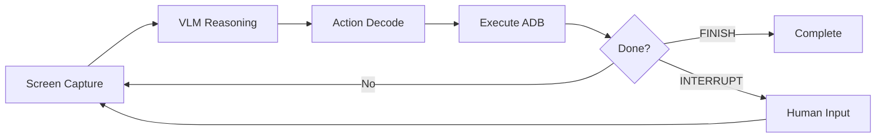

<div align="center">
  <a href="README.md">English</a> | <a href="README_KR.md">한국어</a> | <a href="README_CN.md"><b>简体中文</b></a>
</div>

# 🔨 AgentStudio

<div align="center">
<a href="https://pseudo-lab.com"></a>
<a href="https://discord.gg/EPurkHVtp2"></a>
<a href="https://github.com/Pseudo-Lab/Agent_Studio/stargazers"></a>
<a href="https://github.com/Pseudo-Lab/Agent_Studio/network/members"></a>
<a href="https://github.com/Pseudo-Lab/Agent_Studio/pulls"></a>
<a href="https://github.com/Pseudo-Lab/Agent_Studio/issues"></a>
<a href="https://github.com/Pseudo-Lab/Agent_Studio/graphs/contributors"></a>
<a href="https://hits.seeyoufarm.com"></a>
</div>
<br>

> 🔨 **AgentStudio** - Pseudo-Lab 11th AI Agent Project  
> "Bridging the intergenerational knowledge gap with AI and sharing positive influence."

---

## 🤖 Kiosk Agent

> **Vision-Language-Action (VLA) Agent for Automated Kiosk Interaction**

Kiosk Agent is an AI system that utilizes Vision-Language Models (VLM) to automatically control Android kiosk applications. It interprets visual interfaces and executes precise actions to assist users who may find digital kiosks challenging.


### ✨ Features

- **Gemini-Powered Reasoning**: Support for both `gemini-3-flash` (high-speed) and `gemini-3-pro` (high-reasoning) models.
- **VLA Paradigm**: Seamless workflow: Vision → Language → Action.
- **[AG-UI Protocol](https://github.com/ag-ui-protocol/ag-ui)**: Standardized agent-to-UI communication protocol via SSE.
- **Multi-Framework Support**: Built on LangGraph, with extensions for CrewAI and Google ADK.
- **Human-in-the-Loop (HITL)**: Asks the user for input when subjective choices are required.
- **Planning Mode**: Decomposes complex requests into steps with real-time To-do tracking.
- **Voice Interface**: Supports TTS (CosyVoice3) and STT (Google Cloud).
- **Real-time Dashboard**: Live monitoring of agent status and screen interactions.

---

## 🧠 Model Configuration

AgentStudio allows you to switch between different Vision-Language Models depending on your needs.

| Provider | Model | Status | Key Advantage |
| :--- | :--- | :--- | :--- |
| **Google** | `gemini-3-flash` | ✅ Supported | Low latency and cost-efficient |
| **Google** | `gemini-3-pro` | ✅ Supported | Advanced reasoning for complex UI |
| **OpenAI** | `gpt-4o-mini` | ✅ Supported | Robust performance across various tasks |
| **Google** | `gemma-2` | 🔜 Roadmap | Optimized for on-device/local privacy |

To switch models, update your `.env` file:
```bash
MODEL_PROVIDER=gemini
GEMINI_MODEL=gemini-3-flash # Options: gemini-3-flash, gemini-3-pro

```

---

## 📐 Architecture

### 🔄 VLA Workflow

The VLA paradigm is a continuous cycle where the agent observes, reasons, and executes.


```mermaid
flowchart LR
    A[Screen Capture] --> B[VLM Reasoning]
    B --> C[Action Decode]
    C --> D[Execute ADB]
    D --> E{Done?}
    E -->|No| A
    E -->|FINISH| F[Complete]
    E -->|INTERRUPT| G[Human Input]
    G --> A

```

| Phase | Description |
| --- | --- |
| **Screen Capture** | Captures Android device screen via ADB |
| **VLM Reasoning** | Gemini analyzes the screen to decide the next action |
| **Action Decode** | Parses VLM output into structured executable commands |
| **Execute ADB** | Controls the device using ADB (tap, swipe, input) |
| **INTERRUPT** | Triggers HITL when user intervention is required |

### 🔀 LangGraph State Machine

We manage the agent's logic flow using LangGraph for stable state transitions.


```mermaid
flowchart TD
    START([Start]) --> VLM[VLM Node]
    VLM --> EXEC[Execute Node]
    EXEC --> ROUTER{Router}
    ROUTER -->|LOOP| VLM
    ROUTER -->|INTERRUPT| HUMAN[Human Node]
    ROUTER -->|FINISH| END([End])
    HUMAN -->|Resume| VLM
    HUMAN -->|Abort| END

```

---

## 🚀 Installation

### Prerequisites

* **Python**: 3.10+ (3.11 recommended)
* **Node.js**: 18+ (for Dashboard)
* **uv**: Latest (Fast Python package manager)
* **ADB**: Android Debug Bridge installed

### Step 1: Clone Repository

```bash
git clone [https://github.com/Pseudo-Lab/Agent_Studio.git](https://github.com/Pseudo-Lab/Agent_Studio.git)
cd Agent_Studio

```

### Step 2: Environment Setup (using uv)

```bash
# Create and activate virtual environment
uv venv .venv
source .venv/bin/activate

# Install dependencies in editable mode
uv pip install -e backend/

```

### Step 3: Configure Environment Variables

```bash
cp .env.example .env
# Edit .env with your GOOGLE_API_KEY

```

---

## 🎯 Supported Actions

| Action | Parameters | Description |
| --- | --- | --- |
| `CLICK` | `x, y` | Tap specific coordinates |
| `INPUT` | `text` | Type text into a field |
| `SWIPE` | `x1, y1, x2, y2` | Scroll or navigate |
| `INTERRUPT` | `question` | Ask user for guidance (HITL) |
| `FINISH` | - | Task completed successfully |

---

## 🗓️ Roadmap

### ✅ v1.0.0 (Current)

* LangGraph-based VLA Agent loop.
* Support for **Gemini 3 Flash/Pro**.
* Planning Mode & HITL system.
* Real-time Dashboard via AG-UI Protocol.

### 🔜 v1.1.0 (Scheduled Jan 2026)

* **Gemma Integration**: Support for lightweight, on-device local models.
* **Microsoft Agent Framework**: Semantic Kernel & Azure AI Agent Service integration.
* **Google ADK**: Native Gemini Agent Framework support.
* **CrewAI**: Multi-agent collaboration workflows.

---

## 👥 Team: Agent Studio (Pseudo-Lab)

| Name | Role | Focus |
| --- | --- | --- |
| [Jaehyun Kim](https://github.com/jh941213) | Builder | Frontend (Next.js), Backend (FastAPI) |
| [Seunghyeok Kim](https://github.com/SeungHyeokKim) | Runner | LangGraph, Reasoning, Prompt Engineering |
| [Gyumin Lee](https://github.com/qmin2) | Runner | VLA Mechanism, LangGraph Architecture |
| [Minjung Jeon](https://github.com/ummjevel) | Runner | Voice (TTS/STT), Google ADK |

---

## 🗞 License

This project is licensed under the **Apache License 2.0**.

---

<div align="center">
Developed with ❤️ by <b>Pseudo-Lab</b>
</div>
