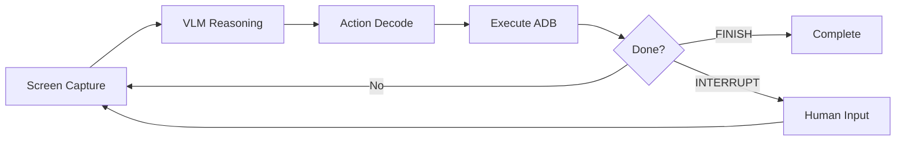
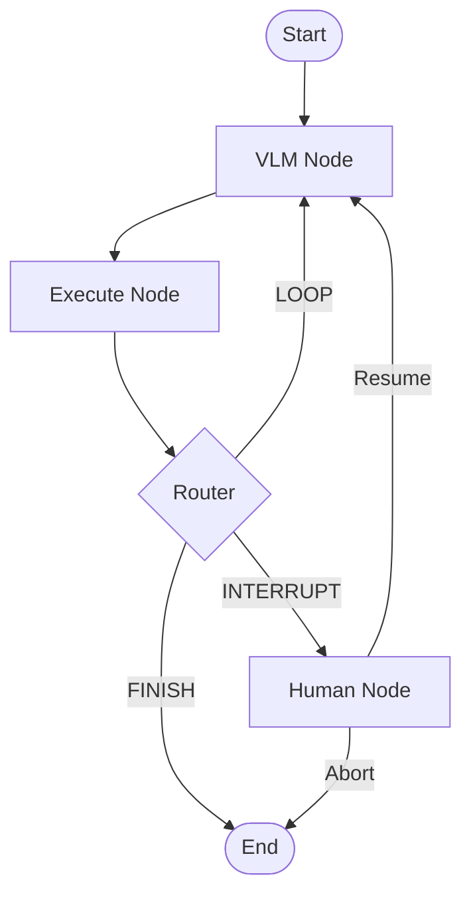
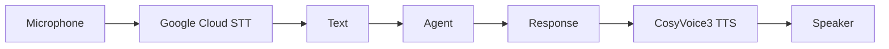
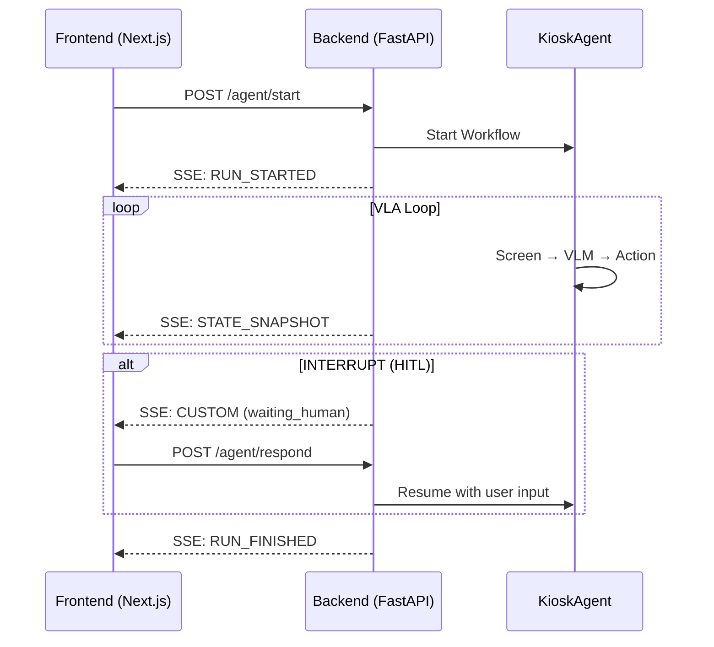

# 🔨 AgentStudio

<h1 align="center"> AgentStudio </h1>

<div align="center">
<a href="https://pseudo-lab.com"></a>
<a href="https://discord.gg/EPurkHVtp2"></a>
<a href="https://github.com/Pseudo-Lab/Agent_Studio/stargazers"></a>
<a href="https://github.com/Pseudo-Lab/Agent_Studio/network/members"></a>
<a href="https://github.com/Pseudo-Lab/Agent_Studio/pulls"></a>
<a href="https://github.com/Pseudo-Lab/Agent_Studio/issues"></a>
<a href="https://github.com/Pseudo-Lab/Agent_Studio/graphs/contributors"></a>
<a href="https://hits.seeyoufarm.com"></a>
</div>
<br>

> 🔨 AgentStudio - 가짜연구소 11기 AI Agent 프로젝트  
> "AI로 세대간의 지식격차를 줄이고, 선한 영향력을 나누자"

---

## 🤖 Kiosk Agent

> **Vision-Language-Action (VLA) Agent for Automated Kiosk Interaction**

키오스크 에이전트는 Vision-Language Model (VLM)을 활용하여 Android 키오스크 애플리케이션을 자동으로 제어하는 AI 에이전트 시스템입니다.


### ✨ Features

- **VLA Paradigm**: Vision → Language → Action 워크플로우
- **[AG-UI Protocol](https://github.com/ag-ui-protocol/ag-ui)**: 표준화된 에이전트-UI 통신 프로토콜
- **Multi-Framework Support**: LangGraph 기본, CrewAI/Google ADK 확장 가능
- **Human-in-the-Loop**: 주관적 선택이 필요할 때 사용자에게 질문
- **Voice Interface**: TTS (CosyVoice3) / STT (Google Cloud) 지원
- **Real-time Dashboard**: 에이전트 상태 실시간 모니터링

---

## 📐 Architecture

### 🔄 VLA Workflow

VLA (Vision-Language-Action) 패러다임은 에이전트가 화면을 "보고" → "이해하고" → "행동하는" 순환 구조입니다.


```mermaid
flowchart LR
    A[Screen Capture] --> B[VLM Reasoning]
    B --> C[Action Decode]
    C --> D[Execute ADB]
    D --> E{Done?}
    E -->|No| A
    E -->|FINISH| F[Complete]
    E -->|INTERRUPT| G[Human Input]
    G --> A
```

| 단계 | 설명 |
|------|------|
| **Screen Capture** | ADB를 통해 Android 디바이스 화면 캡처 |
| **VLM Reasoning** | Gemini/GPT-4V가 화면을 분석하고 다음 액션 결정 |
| **Action Decode** | VLM 출력을 파싱하여 구조화된 액션 추출 |
| **Execute ADB** | ADB 명령어로 실제 디바이스 조작 |
| **INTERRUPT** | 사용자 선택이 필요한 경우 Human-in-the-Loop |

### 🔀 LangGraph State Machine

LangGraph 기반으로 상태 기계를 구현하여 에이전트 흐름을 관리합니다.


```mermaid
flowchart TD
    START([Start]) --> VLM[VLM Node]
    VLM --> EXEC[Execute Node]
    EXEC --> ROUTER{Router}
    ROUTER -->|LOOP| VLM
    ROUTER -->|INTERRUPT| HUMAN[Human Node]
    ROUTER -->|FINISH| END([End])
    HUMAN -->|Resume| VLM
    HUMAN -->|Abort| END
```

| Node | 역할 |
|------|------|
| **VLM Node** | 스크린샷 캡처 → VLM 추론 → 액션 파싱 |
| **Execute Node** | 액션을 ADB 명령으로 변환 및 실행 |
| **Router** | 액션 타입에 따라 다음 노드 결정 |
| **Human Node** | HITL 인터럽트 처리 및 사용자 응답 대기 |

### 🎙️ Voice Pipeline

음성 인터페이스로 사용자와 자연스럽게 상호작용합니다.


```mermaid
flowchart LR
    MIC[Microphone] --> STT[Google Cloud STT]
    STT --> TEXT[Text]
    TEXT --> AGENT[Agent]
    AGENT --> RESP[Response]
    RESP --> TTS[CosyVoice3 TTS]
    TTS --> SPEAKER[Speaker]
```

| 컴포넌트 | 기술 | 설명 |
|----------|------|------|
| **STT** | Google Cloud Speech-to-Text | 실시간 음성 인식 |
| **TTS** | CosyVoice3 (MLX) | Zero-shot 음성 합성, 커스텀 캐릭터 음성 |

### 📡 AG-UI Protocol

[AG-UI](https://github.com/ag-ui-protocol/ag-ui)는 AI 에이전트와 프론트엔드 간의 표준화된 통신 프로토콜입니다. SSE (Server-Sent Events) 기반으로 실시간 스트리밍을 지원합니다.


```mermaid
sequenceDiagram
    participant UI as Frontend (Next.js)
    participant API as Backend (FastAPI)
    participant Agent as KioskAgent
    
    UI->>API: POST /agent/start
    API->>Agent: Start Workflow
    API-->>UI: SSE: RUN_STARTED
    
    loop VLA Loop
        Agent->>Agent: Screen → VLM → Action
        API-->>UI: SSE: STATE_SNAPSHOT
    end
    
    alt INTERRUPT (HITL)
        API-->>UI: SSE: CUSTOM (waiting_human)
        UI->>API: POST /agent/respond
        API->>Agent: Resume with user input
    end
    
    API-->>UI: SSE: RUN_FINISHED
```

#### AG-UI Event Types

| Event Type | 설명 | Payload |
|------------|------|---------|
| `RUN_STARTED` | 에이전트 실행 시작 | `threadId`, `runId`, `timestamp` |
| `STATE_SNAPSHOT` | 상태 업데이트 | `snapshot` (thought, action, iteration 등) |
| `CUSTOM` | 커스텀 이벤트 | `name`, `value` |
| `RUN_ERROR` | 에러 발생 | `message`, `code`, `timestamp` |
| `RUN_FINISHED` | 실행 완료 | `result`, `threadId`, `runId` |

#### Custom Events

| Name | 설명 | Value |
|------|------|-------|
| `waiting_human` | HITL 대기 상태 | `thread_id`, `character` |
| `tts_generated` | TTS 오디오 생성 완료 | `audio_path`, `final_thought` |

#### SSE 스트림 예시

```bash
# POST /agent/start 응답 (SSE)

event: data
data: {"type": "RUN_STARTED", "threadId": "abc-123", "runId": "xyz-456", "timestamp": 1705123456789}

event: data
data: {"type": "STATE_SNAPSHOT", "snapshot": {"status": "running", "iteration": 1, "thought": "메뉴 버튼을 찾고 있습니다...", "action": "CLICK"}}

event: data
data: {"type": "CUSTOM", "name": "waiting_human", "value": {"thread_id": "abc-123", "question": "사이즈를 선택해주세요"}}

event: data
data: {"type": "RUN_FINISHED", "threadId": "abc-123", "result": {"status": "waiting_human"}}
```

---

## 📁 Project Structure

```
kiosk-agent/
├── backend/                      # Python 백엔드
│   ├── kiosk_agent/              # 코어 에이전트 라이브러리
│   │   ├── core/                 # ADB 제어, 스크린샷 캡처
│   │   │   ├── control.py        # ADB 명령 실행 (tap, swipe, input)
│   │   │   ├── perception.py     # 스크린샷 캡처 및 이미지 처리
│   │   │   └── translator.py     # 액션 → ADB 명령 변환
│   │   ├── llm/                  # LLM 클라이언트
│   │   │   ├── base.py           # 추상 베이스 클래스
│   │   │   ├── gemini.py         # Google Gemini Vision
│   │   │   ├── openai.py         # OpenAI GPT-4V
│   │   │   └── local.py          # Local vLLM (AgentCPM 등)
│   │   ├── frameworks/           # 에이전트 프레임워크
│   │   │   ├── langgraph/        # LangGraph 구현 (기본)
│   │   │   │   ├── agent.py      # KioskAgent 메인 클래스
│   │   │   │   ├── graph.py      # StateGraph 정의
│   │   │   │   ├── nodes.py      # 노드 구현 (VLM, Execute, Human)
│   │   │   │   └── prompts.py    # 프롬프트 템플릿
│   │   │   ├── google-adk/       # Google ADK (예정)
│   │   │   └── crewai/           # CrewAI (예정)
│   │   ├── prompts/              # 시스템 프롬프트
│   │   │   └── system.py         # VLM 시스템 프롬프트
│   │   ├── voice/                # 음성 모듈
│   │   │   ├── stt.py            # Google Cloud STT
│   │   │   └── tts.py            # CosyVoice3 TTS
│   │   ├── config.py             # 설정 클래스 정의
│   │   └── characters.py         # 캐릭터 로더
│   ├── api/                      # FastAPI 서버
│   │   ├── main.py               # 앱 엔트리포인트
│   │   ├── routes/               # API 라우트
│   │   │   ├── agent.py          # /agent/* 엔드포인트
│   │   │   ├── voice.py          # /stt/*, /tts/* 엔드포인트
│   │   │   └── health.py         # /health 엔드포인트
│   │   ├── session.py            # HITL 세션 관리
│   │   └── streamer.py           # SSE 스트리밍
│   ├── config/                   # 설정 파일
│   │   └── characters.yaml.example  # 캐릭터 설정 템플릿
│   └── requirements.txt
│
├── web/                          # Next.js 프론트엔드
│   ├── app/                      # App Router
│   │   ├── demo/                 # 메인 데모 페이지
│   │   │   ├── page.tsx          # 데모 UI
│   │   │   └── components/       # ChatInputBar, ResultAudioButton
│   │   └── member/               # 팀원 소개 페이지
│   └── components/               # 공통 React 컴포넌트
│
├── output/                       # 런타임 출력 (gitignore)
│   └── data/
│       ├── screenshot/           # 캡처된 스크린샷
│       └── tts/                  # TTS 오디오 파일
│
├── run.sh                        # 통합 실행 스크립트
├── .env.example                  # 환경변수 예시
└── RELEASE_NOTES.md              # 릴리즈 노트
```

---

## 🚀 Installation

### Prerequisites

| 요구사항 | 버전 | 비고 |
|----------|------|------|
| Python | 3.10+ | 3.11 권장 |
| Node.js | 18+ | npm 포함 |
| uv | 최신 | Python 패키지 매니저 |
| ADB | - | Android Debug Bridge |

### Step 1: Clone Repository

```bash
git clone https://github.com/Pseudo-Lab/Agent_Studio.git
cd Agent_Studio
```

### Step 2: Python Environment Setup

[uv](https://github.com/astral-sh/uv)를 사용하여 가상환경을 생성하고 의존성을 설치합니다.

```bash
# uv 설치 (없는 경우)
curl -LsSf https://astral.sh/uv/install.sh | sh

# 가상환경 생성
uv venv .venv_mac

# 가상환경 활성화
source .venv_mac/bin/activate

# 의존성 설치 (editable mode)
uv pip install -e backend/
```

### Step 3: Environment Variables

```bash
# 예시 파일 복사
cp .env.example .env

# .env 파일 편집
vi .env  # 또는 선호하는 에디터
```

#### 필수 환경변수

```bash
# ─────────────────────────────────────────────────────────
# API Keys (필수)
# ─────────────────────────────────────────────────────────
GOOGLE_API_KEY=your-gemini-api-key-here

# STT 사용 시 필수 (Google Cloud Speech-to-Text)
GOOGLE_APPLICATION_CREDENTIALS=./your-service-account.json
```

#### 선택 환경변수

```bash
# ─────────────────────────────────────────────────────────
# Model Configuration
# ─────────────────────────────────────────────────────────
MODEL_PROVIDER=gemini                    # gemini | chatgpt | local_vllm
GEMINI_MODEL=gemini-2.0-flash           # Gemini 모델명
OPENAI_MODEL=gpt-4o-mini                 # OpenAI 모델명 (chatgpt 사용 시)
MODEL_TEMPERATURE=0.1                    # 낮을수록 일관된 응답

# ─────────────────────────────────────────────────────────
# ADB & Device
# ─────────────────────────────────────────────────────────
ADB_PATH=adb                             # ADB 바이너리 경로
DEVICE_ID=                               # 디바이스 ID (빈값=자동감지)

# ─────────────────────────────────────────────────────────
# Agent Runtime
# ─────────────────────────────────────────────────────────
MAX_ITERATIONS=20                        # 최대 반복 횟수
AGENT_PROGRESS_THRESHOLD=0.02            # 화면 변화 감지 임계값 (0.0~1.0)
AGENT_RECURSION_LIMIT=100                # LangGraph 재귀 제한

# ─────────────────────────────────────────────────────────
# Output Directories (상대경로 지원)
# ─────────────────────────────────────────────────────────
SCREENSHOTS_DIR=./output/data/screenshot # 스크린샷 저장 경로
TTS_OUTPUT_DIR=./output/data/tts         # TTS 오디오 저장 경로

# ─────────────────────────────────────────────────────────
# TTS Configuration
# ─────────────────────────────────────────────────────────
AGENT_TTS_KEEP_LAST_N=5                  # TTS 파일 보관 개수
AGENT_TTS_THOUGHT=0                      # Thought TTS 활성화 (1=on)
AGENT_TTS_THOUGHT_MAX_CHARS=320          # Thought TTS 최대 문자수

# ─────────────────────────────────────────────────────────
# Local vLLM (선택)
# ─────────────────────────────────────────────────────────
VLLM_BASE_URL=http://localhost:8000      # vLLM 서버 URL
VLLM_MODEL_NAME=AgentCPM-GUI             # 모델명
```

### Step 4: Character Setup (TTS 사용 시)

TTS 캐릭터 음성을 사용하려면 캐릭터 설정 파일을 생성합니다.

```bash
# 예시 파일 복사
cp backend/config/characters.yaml.example backend/config/characters.yaml

# 설정 편집
vi backend/config/characters.yaml
```

**characters.yaml 예시:**

```yaml
characters:
  - id: my_character
    name: 캐릭터 이름
    nickname: 캐릭터 별명
    ref_audio: my_reference.wav          # 프로젝트 루트에 배치
    ref_text: >-
      레퍼런스 오디오의 텍스트 내용입니다.
      TTS 모델이 음성 스타일을 학습합니다.
    image_path: /images/my_character.jpg
    completion_messages:
      - 완료되었습니다.
      - 준비되었습니다.
    quit_messages:
      - 감사합니다.
      - 다음에 또 오세요.
```

> **📝 Note**: 레퍼런스 오디오는 3~15초 분량의 깨끗한 음성 WAV 파일이 좋습니다.

### Step 5: ADB Setup

Android 디바이스를 ADB로 연결합니다.

#### 유선 연결

```bash
# 디바이스 연결 확인
adb devices

# 출력 예시:
# List of devices attached
# XXXXXXX device
```

#### 무선 연결 (권장)

```bash
# 1. 디바이스에서 개발자 옵션 → 무선 디버깅 활성화
# 2. 페어링 코드로 연결
adb pair <IP>:<PAIRING_PORT>  # 페어링 코드 입력

# 3. 연결
adb connect <IP>:5555

# 4. 확인
adb devices
```

### Step 6: Run

```bash
# Backend + Frontend 동시 실행
./run.sh
```

**서비스 URL:**
- **Frontend**: http://localhost:3000
- **Backend API**: http://localhost:8080
- **API Docs**: http://localhost:8080/docs

---

## 🎯 Supported Actions

VLM이 출력하는 액션 타입과 의미입니다.

| Action | Parameters | Description |
|--------|------------|-------------|
| `CLICK` | `x, y` | 화면 좌표 탭 |
| `LONG_CLICK` | `x, y` | 길게 누르기 |
| `SWIPE` | `x1, y1, x2, y2` | 스크롤/스와이프 |
| `INPUT` | `text` | 텍스트 입력 |
| `BACK` | - | 뒤로가기 |
| `HOME` | - | 홈 화면 |
| `INTERRUPT` | `question, options` | 사용자 입력 요청 (HITL) |
| `FINISH` | - | 작업 완료 |

### INTERRUPT (Human-in-the-Loop)

사용자의 주관적 선택이 필요할 때 에이전트가 질문합니다.

```json
{
  "action": "INTERRUPT",
  "question": "어떤 사이즈를 선택할까요?",
  "options": ["Small", "Medium", "Large"]
}
```

---

## 🔌 API Reference

### Endpoints

| Method | Endpoint | Description |
|--------|----------|-------------|
| GET | `/health` | 서버 상태 확인 |
| POST | `/agent/start` | 에이전트 실행 시작 (SSE 스트림) |
| POST | `/agent/respond` | HITL 응답 전송 |
| POST | `/agent/interrupt` | 강제 중단 |
| POST | `/stt/transcribe` | 음성 → 텍스트 변환 |
| GET | `/tts/audio/{filename}` | TTS 오디오 파일 제공 |

### 사용 예시

#### 에이전트 시작

```bash
curl -X POST http://localhost:8080/agent/start \
  -H "Content-Type: application/json" \
  -d '{
    "instruction": "아메리카노 한 잔 주문해줘",
    "character_id": "my_character"
  }'
```

**응답 (SSE 스트림):**

```
event: status
data: {"status": "Agent started"}

event: thinking
data: {"thought": "화면을 분석합니다..."}

event: action
data: {"action": "CLICK", "target": "메뉴 버튼", "coordinates": [540, 960]}

event: interrupt
data: {"question": "사이즈를 선택해주세요", "options": ["Tall", "Grande", "Venti"]}
```

#### HITL 응답

```bash
curl -X POST http://localhost:8080/agent/respond \
  -H "Content-Type: application/json" \
  -d '{
    "response": "Grande"
  }'
```

#### STT (음성 인식)

```bash
curl -X POST http://localhost:8080/stt/transcribe \
  -F "audio=@recording.wav"
```

---

## 🔧 Advanced Configuration

### Model Provider 변경

```bash
# Gemini (기본)
MODEL_PROVIDER=gemini
GOOGLE_API_KEY=your-key

# OpenAI GPT-4V
MODEL_PROVIDER=chatgpt
OPENAI_API_KEY=your-key

# Local vLLM
MODEL_PROVIDER=local_vllm
VLLM_BASE_URL=http://localhost:8000
```

### Dry Run Mode

실제 디바이스 없이 테스트하려면 `DRY_RUN` 환경변수를 설정합니다.

```bash
export DRY_RUN=1
./run.sh
```

Dry Run 모드에서는 ADB 명령이 실제로 실행되지 않고 로그만 출력됩니다.

### Progress Threshold 조정

`AGENT_PROGRESS_THRESHOLD`는 화면 변화 감지 임계값입니다.

```bash
# 민감하게 (작은 변화도 감지)
AGENT_PROGRESS_THRESHOLD=0.01

# 둔감하게 (큰 변화만 감지)
AGENT_PROGRESS_THRESHOLD=0.05
```

---

## 🐛 Troubleshooting

### 자주 발생하는 문제

<details>
<summary><b>ADB 연결 실패</b></summary>

```
error: no devices/emulators found
```

**해결:**
1. USB 디버깅 활성화 확인
2. 무선 연결 시: `adb connect <IP>:5555`
3. 방화벽 확인 (포트 5555)

</details>

<details>
<summary><b>Gemini API 키 오류</b></summary>

```
ValueError: Set ModelConfig.gemini_api_key when provider='gemini'.
```

**해결:**
```bash
# .env 파일에 API 키 설정
GOOGLE_API_KEY=your-actual-api-key
```

</details>

<details>
<summary><b>STT 인증 오류</b></summary>

```
ValueError: GOOGLE_APPLICATION_CREDENTIALS 환경변수에 서비스 계정 JSON 파일 경로를 설정해주세요.
```

**해결:**
1. Google Cloud Console에서 서비스 계정 생성
2. JSON 키 다운로드
3. `.env` 파일에 경로 설정:
```bash
GOOGLE_APPLICATION_CREDENTIALS=./your-service-account.json
```

</details>

<details>
<summary><b>TTS 캐릭터 로드 실패</b></summary>

```
No characters found in YAML file
```

**해결:**
1. `backend/config/characters.yaml` 파일 존재 확인
2. 레퍼런스 오디오 파일 경로 확인
3. YAML 문법 오류 확인

</details>

<details>
<summary><b>Port Already in Use</b></summary>

```
error: [Errno 48] Address already in use
```

**해결:**
```bash
# 기존 프로세스 종료
lsof -i :8080 | grep LISTEN | awk '{print $2}' | xargs kill -9
lsof -i :3000 | grep LISTEN | awk '{print $2}' | xargs kill -9

# 다시 실행
./run.sh
```

</details>

---

## 🗓️ Roadmap

### ✅ v1.0.0 (현재)

- LangGraph 기반 VLA 에이전트
- TTS/STT 음성 인터페이스
- Human-in-the-Loop 피드백 시스템
- Next.js 실시간 대시보드

### 🔜 v1.1.0 (2026년 1월 예정)

| Framework | Status | Description |
|-----------|--------|-------------|
| **Microsoft Agent Framework** | 🚧 개발 중 | Azure AI Agent Service, Semantic Kernel 연동 |
| **Google ADK** | 🚧 개발 중 | Gemini 네이티브 에이전트 프레임워크 |
| **CrewAI** | 📋 계획 중 | 멀티 에이전트 협업 워크플로우 |

### 🎯 Future Plans

- **Planning Mode**: 복잡한 태스크를 서브태스크로 분해
- **Context Management**: 장기 메모리 및 대화 컨텍스트 관리
- **On-device Model**: 경량화 모델 (AgentCPM 등)
- **Microservice Architecture**: 스케일러블 아키텍처

> 📝 자세한 내용은 [RELEASE_NOTES.md](./RELEASE_NOTES.md) 참고

---

## 👥 Team

**가짜연구소 11기 Agent Studio**

| 역할 | 이름 | 소속 | 기술 스택 | 주요 관심 분야 |
|------|------|------|-----------|----------------|
| **빌더** | [김재현](https://github.com/jh941213) | KTDS |   | UI 구현, Backend |
| **러너** | [김승혁](https://github.com/SeungHyeokKim) | namu |    | AI Agent 개발, LangGraph, Prompt |
| **러너** | [이규민](https://github.com/qmin2) | KT |   | LangGraph, VLA 메커니즘 설계 |
| **러너** | [전민정](https://github.com/ummjevel) | AICESS |    | TTS/STT, AI Agent 개발, Google ADK |

### 📝 프로젝트 후기

- [김재현 - Agent Studio: 2nd Grand Gathering 🚀](https://www.linkedin.com/posts/kjh941213_qootfosmyqvosqs-pseudolab-agentstudio-activity-7415701764693262336-NPb9)
- [김승혁 - PseudoLab AgentStudio AI Agent](https://www.linkedin.com/posts/%EC%8A%B9%ED%98%81-%EA%B9%80-9092b5306_pseudolab-agentstudio-aiagent-activity-7415719142403653632-tuwY)
- [전민정 - 가짜연구소 2nd Grand Gathering 후기](https://www.linkedin.com/posts/mseagle2023_qootfosmyqvosqs-pseudolab-agentstudio-activity-7415703068995956736-j2MY)

---

## 🙏 Acknowledgement

이 프로젝트는 **가짜연구소 11기 Agent Studio**에서 개발되었습니다.

AgentStudio is developed as part of Pseudo-Lab's Open Research Initiative. Special thanks to our contributors and the open source community for their valuable insights and contributions.

---

## 👋 About Pseudo Lab

[Pseudo-Lab](https://pseudo-lab.com/)은 머신러닝과 AI 기술 발전을 위한 비영리 단체입니다.

핵심 가치: **Sharing, Motivation, Collaborative Joy**

5k+ 연구자가 참여하는 글로벌 커뮤니티로, 머신러닝과 AI 기술 발전에 기여하고 있습니다.

---

## 😃 Contributors

<a href="https://github.com/Pseudo-Lab/Agent_Studio/graphs/contributors">
  
</a>

---

## 🗞 License

This project is licensed under the [Apache License 2.0](https://opensource.org/licenses/Apache-2.0).
