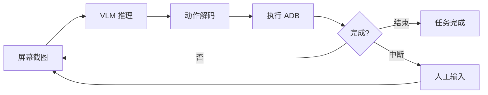

<div align="center">
  <a href="README.md">English</a> | <a href="README_KR.md">한국어</a> | <a href="README_CN.md"><b>简体中文</b></a>
</div>

# 🔨 AgentStudio

<div align="center">
<a href="https://pseudo-lab.com"></a>
<a href="https://discord.gg/EPurkHVtp2"></a>
<a href="https://github.com/Pseudo-Lab/Agent_Studio/stargazers"></a>
<a href="https://github.com/Pseudo-Lab/Agent_Studio/network/members"></a>
<a href="https://github.com/Pseudo-Lab/Agent_Studio/pulls"></a>
<a href="https://github.com/Pseudo-Lab/Agent_Studio/issues"></a>
<a href="https://github.com/Pseudo-Lab/Agent_Studio/graphs/contributors"></a>
<a href="https://hits.seeyoufarm.com"></a>
</div>
<br>

> 🔨 **AgentStudio** - Pseudo-Lab 第11期 AI Agent 项目  
> "利用 AI 弥合代际知识鸿沟，传递正向影响力。"

---

## 🤖 自助终端智能体 (Kiosk Agent)

> **基于 Vision-Language-Action (VLA) 范式的自助终端自动化控制智能体**

Kiosk Agent 是一款利用视觉语言模型 (VLM) 自动控制 Android 自助终端应用程序的 AI 系统。它能够像人一样“看”屏幕、理解界面并执行精确操作，旨在帮助对数字设备感到困难的用户。


### ✨ 核心特性

- **强劲的 Gemini 驱动**: 原生支持 `gemini-3-flash`（极速）和 `gemini-3-pro`（深度推理）模型。
- **VLA 范式**: 完整的 Vision（视觉）→ Language（语言/推理）→ Action（动作）循环。
- **[AG-UI Protocol](https://github.com/ag-ui-protocol/ag-ui)**: 基于 SSE 的标准化智能体与前端通信协议。
- **多框架支持**: 基于 LangGraph 构建，并可扩展至 CrewAI 和 Google ADK。
- **人机协同 (HITL)**: 当需要主观决策（如选餐偏好）时，智能体会主动询问用户。
- **规划模式 (Planning Mode)**: 将复杂任务分解为多个步骤，并通过待办列表 (To-do) 实时展示进展。
- **语音交互**: 支持文本转语音 (CosyVoice3) 和语音转文本 (Google Cloud)。
- **实时看板**: 实时监控智能体的思考过程 (Reasoning) 和屏幕操作状态。

---

## 🧠 模型配置 (Model Configuration)

AgentStudio 支持多种视觉语言模型，您可以根据需求灵活切换。

| 供应商 | 模型名称 | 状态 | 推荐场景 |
| :--- | :--- | :--- | :--- |
| **Google** | `gemini-3-flash` | ✅ 已支持 | 默认模型。响应速度快，性价比高 |
| **Google** | `gemini-3-pro` | ✅ 已支持 | 复杂 UI 布局分析及高阶逻辑推理 |
| **OpenAI** | `gpt-4o-mini` | ✅ 已支持 | 性能稳定的替代方案 |
| **Google** | `gemma-2` | 🔜 路线图中 | 适用于端侧处理和保护隐私的本地运行 |

切换模型只需修改 `.env` 文件：
```bash
MODEL_PROVIDER=gemini
GEMINI_MODEL=gemini-3-flash # 可选: gemini-3-flash 或 gemini-3-pro

```

---

## 📐 系统架构

### 🔄 VLA 工作流

VLA 范式是一个持续的循环：智能体观察屏幕、进行推理并执行动作。



---

## 🚀 安装指南

### 环境要求

* **Python**: 3.10+ (推荐 3.11)
* **Node.js**: 18+ (用于前端看板)
* **uv**: 最新版本 (高性能 Python 包管理器)
* **ADB**: 已安装 Android Debug Bridge 且已配置环境变量

### 步骤 1: 克隆仓库

```bash
git clone [https://github.com/Pseudo-Lab/Agent_Studio.git](https://github.com/Pseudo-Lab/Agent_Studio.git)
cd Agent_Studio

```

### 步骤 2: Python 环境配置 (使用 uv)

```bash
# 创建并激活虚拟环境
uv venv .venv
source .venv/bin/activate

# 以可编辑模式安装依赖
uv pip install -e backend/

```

### 步骤 3: 配置环境变量

```bash
cp .env.example .env
# 编辑 .env 文件并输入您的 API Key

```

---

## 🎯 支持的操作 (Actions)

| 动作 | 参数 | 说明 |
| --- | --- | --- |
| `CLICK` | `x, y` | 点击屏幕特定坐标 |
| `INPUT` | `text` | 在文本框内输入内容 |
| `SWIPE` | `x1, y1, x2, y2` | 滑动屏幕或滚动列表 |
| `INTERRUPT` | `question` | 请求人工干预 (HITL) |
| `FINISH` | - | 任务成功完成 |

---

## 🗓️ 路线图 (Roadmap)

### ✅ v1.0.0 (当前版本)

* 基于 LangGraph 的 VLA 智能体循环。
* 支持 **Gemini 3 Flash/Pro**。
* 规划模式与人机协同 (HITL) 系统。
* 基于 AG-UI 协议的实时 SSE 看板。

### 🔜 v1.1.0 (计划于 2026年 1月)

* **Gemma 集成**: 支持轻量化端侧本地模型运行。
* **Microsoft Agent Framework**: 集成 Semantic Kernel 与 Azure AI Agent Service。
* **Google ADK**: 支持 Gemini 原生智能体框架。
* **CrewAI**: 支持多智能体协作工作流。

---

## 👥 团队: Agent Studio (Pseudo-Lab)

| 姓名 | 角色 | 核心关注领域 |
| --- | --- | --- |
| [Jaehyun Kim](https://github.com/jh941213) | Builder | 前端 (Next.js), 后端 (FastAPI) |
| [Seunghyeok Kim](https://github.com/SeungHyeokKim) | Runner | LangGraph, 推理引擎, 提示词工程 |
| [Gyumin Lee](https://github.com/qmin2) | Runner | VLA 机制, LangGraph 架构设计 |
| [Minjung Jeon](https://github.com/ummjevel) | Runner | 语音交互 (TTS/STT), Google ADK |

---

## 🗞 许可证

本项目采用 **Apache License 2.0** 许可证。

---

<div align="center">
由 <b>Pseudo-Lab</b> 用 ❤️ 倾力打造
</div>


다른 언어(예: 일본어)가 더 필요하시거나, 특정 섹션의 기술적 설명을 보강하고 싶으시면 말씀해 주세요\!

```
