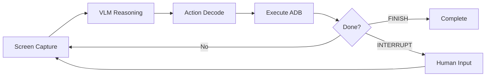
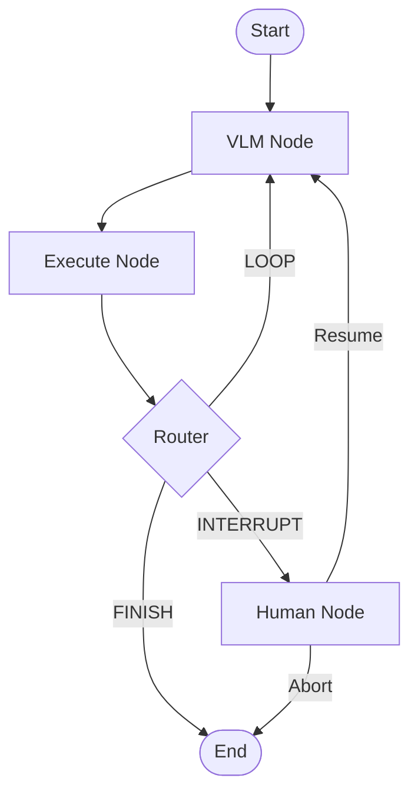

<div align="center">
  <a href="README.md">English</a> | <a href="README_KR.md"><b>한국어</b></a> | <a href="README_CN.md">简体中文</a>
</div>

# 🔨 AgentStudio

<div align="center">
<a href="https://pseudo-lab.com"></a>
<a href="https://discord.gg/EPurkHVtp2"></a>
<a href="https://github.com/Pseudo-Lab/Agent_Studio/stargazers"></a>
<a href="https://github.com/Pseudo-Lab/Agent_Studio/network/members"></a>
<a href="https://github.com/Pseudo-Lab/Agent_Studio/pulls"></a>
<a href="https://github.com/Pseudo-Lab/Agent_Studio/issues"></a>
<a href="https://github.com/Pseudo-Lab/Agent_Studio/graphs/contributors"></a>
<a href="https://hits.seeyoufarm.com"></a>
</div>
<br>

> 🔨 **AgentStudio** - 가짜연구소 11기 AI Agent 프로젝트  
> "AI로 세대간의 지식격차를 줄이고, 선한 영향력을 나누자"

---

## 🤖 키오스크 에이전트 (Kiosk Agent)

> **Vision-Language-Action (VLA) 패러다임 기반 키오스크 자동 제어 에이전트**

키오스크 에이전트는 VLM(Vision-Language Model)을 활용하여 Android 키오스크 애플리케이션을 자동으로 제어하는 AI 시스템입니다. 디지털 기기 사용에 어려움을 겪는 사용자를 돕기 위해 화면을 시각적으로 이해하고 직접 조작합니다.


### ✨ 주요 특징 (Features)

- **강력한 Gemini 추론**: 최신 `gemini-3-flash` 및 `gemini-3-pro` 모델을 지원하여 정교한 화면 분석이 가능합니다.
- **VLA 패러다임**: Vision(시각) → Language(언어/추론) → Action(행동)으로 이어지는 순환 워크플로우를 구현합니다.
- **[AG-UI Protocol](https://github.com/ag-ui-protocol/ag-ui)**: 에이전트와 프론트엔드 간의 표준화된 SSE 실시간 통신을 지원합니다.
- **Human-in-the-Loop (HITL)**: 주관적인 선택(예: 메뉴 옵션 선택)이 필요할 때 사용자에게 질문하고 응답을 기다립니다.
- **Planning Mode**: 복잡한 요청을 여러 단계로 분해하고, To-do 리스트 형태로 실시간 진행 상황을 표시합니다.
- **음성 인터페이스**: TTS (CosyVoice3) 및 STT (Google Cloud)를 통한 자연스러운 음성 상호작용을 지원합니다.
- **실시간 대시보드**: 에이전트의 사고 과정(Reasoning)과 화면 조작 상태를 실시간으로 모니터링합니다.

---

## 🧠 모델 설정 (Model Configuration)

AgentStudio는 작업의 복잡도와 요구 성능에 따라 모델을 자유롭게 선택할 수 있습니다.

| 제공자 | 모델명 | 상태 | 권장 용도 |
| :--- | :--- | :--- | :--- |
| **Google** | `gemini-3-flash` | ✅ 지원됨 | 기본 모델. 빠른 응답 속도와 효율성 |
| **Google** | `gemini-3-pro` | ✅ 지원됨 | 복잡한 UI 레이아웃 분석 및 고차원 추론 |
| **OpenAI** | `gpt-4o-mini` | ✅ 지원됨 | 일관된 성능의 대체 모델 |
| **Google** | `gemma-2` | 🔜 예정 | 온디바이스 처리 및 개인정보 보호 로컬 실행 |

모델을 변경하려면 `.env` 파일의 변수를 수정하세요:
```bash
MODEL_PROVIDER=gemini
GEMINI_MODEL=gemini-3-flash # gemini-3-flash 또는 gemini-3-pro 선택

```

---

## 📐 아키텍처 (Architecture)

### 🔄 VLA 워크플로우

VLA 패러다임은 에이전트가 화면을 보고(See), 이해하고(Understand), 행동하는(Act) 순환 구조입니다.



### 🔀 LangGraph 상태 기계

LangGraph를 사용하여 에이전트의 논리적 흐름과 상태 전이를 관리합니다.



---

## 🚀 설치 방법 (Installation)

### 사전 요구사항

* **Python**: 3.10+ (3.11 권장)
* **Node.js**: 18+ (대시보드 실행용)
* **uv**: 최신 버전 (빠른 패키지 관리자)
* **ADB**: Android Debug Bridge 설치 및 환경변수 설정 완료

### 1단계: 저장소 복제

```bash
git clone [https://github.com/Pseudo-Lab/Agent_Studio.git](https://github.com/Pseudo-Lab/Agent_Studio.git)
cd Agent_Studio

```

### 2단계: 파이썬 환경 설정 (uv 사용)

```bash
# 가상환경 생성 및 활성화
uv venv .venv
source .venv/bin/activate

# 의존성 설치 (Editable 모드)
uv pip install -e backend/

```

### 3단계: 환경 변수 설정

```bash
cp .env.example .env
# .env 파일을 열어 GOOGLE_API_KEY 등을 입력하세요.

```

---

## 🎯 지원 액션 (Supported Actions)

| 액션 | 파라미터 | 설명 |
| --- | --- | --- |
| `CLICK` | `x, y` | 특정 좌표를 클릭 |
| `INPUT` | `text` | 텍스트 입력 필드에 내용 입력 |
| `SWIPE` | `x1, y1, x2, y2` | 화면 스크롤 또는 스와이프 |
| `INTERRUPT` | `question` | 사용자에게 추가 정보를 요청 (HITL) |
| `FINISH` | - | 모든 작업이 성공적으로 완료됨 |

---

## 🗓️ 로드맵 (Roadmap)

### ✅ v1.0.0 (현재)

* LangGraph 기반 VLA 에이전트 루프 구현
* **Gemini 3 (Flash/Pro)** 모델 연동 완료
* Planning Mode 및 HITL(Human-in-the-Loop) 시스템
* AG-UI 프로토콜 기반 실시간 SSE 대시보드

### 🔜 v1.1.0 (2026년 1월 예정)

* **Gemma 통합**: 경량 로컬 모델 지원으로 온디바이스 실행 가능
* **Microsoft Agent Framework**: Semantic Kernel 및 Azure AI Agent Service 연동
* **Google ADK**: Gemini 네이티브 에이전트 프레임워크 지원
* **CrewAI**: 멀티 에이전트 협업 워크플로우 확장

---

## 👥 팀 소개: Agent Studio (가짜연구소 11기)

| 성함 | 역할 | 주요 담당 분야 |
| --- | --- | --- |
| [김재현](https://github.com/jh941213) | 빌더 | 프론트엔드(Next.js), 백엔드(FastAPI) |
| [김승혁](https://github.com/SeungHyeokKim) | 러너 | LangGraph, 추론 엔진, 프롬프트 엔지니어링 |
| [이규민](https://github.com/qmin2) | 러너 | VLA 메커니즘 설계, LangGraph 아키텍처 |
| [전민정](https://github.com/ummjevel) | 러너 | 음성 인터페이스(TTS/STT), Google ADK 연동 |

---

## 🗞 라이선스 (License)

본 프로젝트는 **Apache License 2.0**을 따릅니다.

---

<div align="center">
<b>Pseudo-Lab</b>과 함께 ❤️로 개발되었습니다.
</div>

