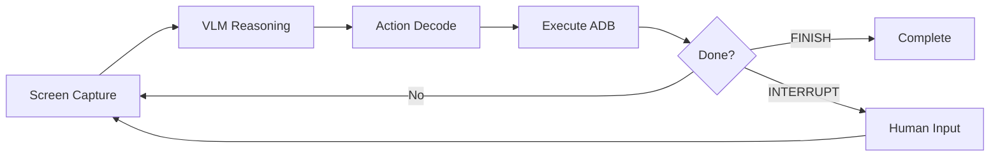
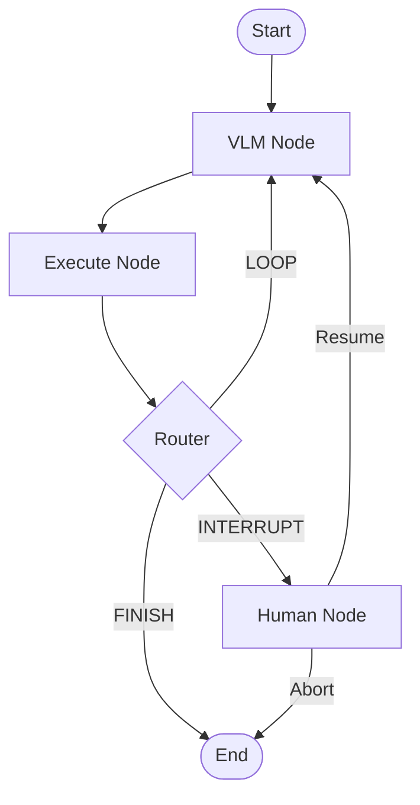
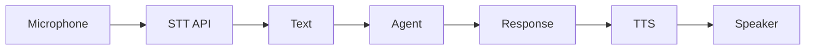

# 🔨 AgentStudio

<h1 align="center"> AgentStudio </h1>

<div align="center">
<a href="https://pseudo-lab.com"></a>
<a href="https://discord.gg/EPurkHVtp2"></a>
<a href="https://github.com/Pseudo-Lab/Agent_Studio/stargazers"></a>
<a href="https://github.com/Pseudo-Lab/Agent_Studio/network/members"></a>
<a href="https://github.com/Pseudo-Lab/Agent_Studio/pulls"></a>
<a href="https://github.com/Pseudo-Lab/Agent_Studio/issues"></a>
<a href="https://github.com/Pseudo-Lab/Agent_Studio/graphs/contributors"></a>
<a href="https://hits.seeyoufarm.com"></a>
</div>
<br>

> 🔨 AgentStudio - 가짜연구소 11기 AI Agent 프로젝트
> "AI로 세대간의 지식격차를 줄이고, 선한 영향력을 나누자"

---

## 🤖 Kiosk Agent

> **Vision-Language-Action (VLA) Agent for Automated Kiosk Interaction**

키오스크 에이전트는 Vision-Language Model (VLM)을 활용하여 Android 키오스크 애플리케이션을 자동으로 제어하는 AI 에이전트 시스템입니다.


### ✨ Features

- **VLA Paradigm**: Vision → Language → Action 워크플로우
- **Multi-Framework Support**: LangGraph 기본, CrewAI/Google ADK 확장 가능
- **Human-in-the-Loop**: 주관적 선택이 필요할 때 사용자에게 질문
- **Voice Interface**: TTS (CosyVoice3) / STT (Google Cloud) 지원
- **Real-time Dashboard**: 에이전트 상태 실시간 모니터링

### 🔄 VLA Workflow



### 🔀 LangGraph State Machine



### 🎙️ Voice Pipeline



### 📁 Project Structure

```
kiosk-agent/
├── backend/                  # Python 백엔드
│   ├── kiosk_agent/          # 코어 에이전트 라이브러리
│   │   ├── core/             # ADB 제어, 스크린샷 캡처
│   │   ├── llm/              # Gemini, OpenAI, Local 클라이언트
│   │   ├── frameworks/       # LangGraph, CrewAI, Google ADK
│   │   ├── prompts/          # 시스템 프롬프트
│   │   └── voice/            # TTS, STT 모듈
│   ├── api/                  # FastAPI 서버
│   ├── config/               # 캐릭터 설정 (YAML)
│   └── requirements.txt
│
├── web/                      # Next.js 프론트엔드
│   ├── app/                  # App Router
│   │   ├── demo/             # 메인 데모 페이지
│   │   └── member/           # 팀원 소개
│   ├── components/           # React 컴포넌트
│   └── package.json
│
├── output/                   # 출력 데이터
│   └── data/
│       ├── screenshot/       # 캡처된 스크린샷
│       └── tts/              # TTS 오디오 파일
│
├── run.sh                    # 통합 실행 스크립트
├── .env                      # 환경변수 (로컬)
└── .env.example              # 환경변수 예시
```

### 🚀 Quick Start

#### Prerequisites

- Python 3.10+
- Node.js 18+
- Android device with ADB enabled
- Gemini API key
- Google Cloud credentials (STT용)

#### 1. Clone & Setup

```bash
git clone https://github.com/Pseudo-Lab/Agent_Studio.git
cd Agent_Studio
```

#### 2. Environment Variables

```bash
cp .env.example .env
# .env 파일에 API 키 입력
```

필수 환경변수:

```bash
GOOGLE_API_KEY=your-gemini-api-key
GOOGLE_APPLICATION_CREDENTIALS=./your-credentials.json
```

#### 3. Run

```bash
# Backend + Frontend 동시 실행
./run.sh
```

Open:

- **Frontend**: [http://localhost:3000](http://localhost:3000)
- **Backend API**: [http://localhost:8080](http://localhost:8080)

### 🎯 Supported Actions

| Action         | Description             |
| -------------- | ----------------------- |
| `CLICK`      | 화면 요소 탭            |
| `LONG_CLICK` | 길게 누르기             |
| `SWIPE`      | 스크롤/스와이프         |
| `INPUT`      | 텍스트 입력             |
| `BACK`       | 뒤로가기                |
| `HOME`       | 홈 화면                 |
| `INTERRUPT`  | 사용자 입력 요청 (HITL) |
| `FINISH`     | 작업 완료               |

### 🔧 Configuration

<details>
<summary><b>Environment Variables (클릭하여 펼치기)</b></summary>

#### API Keys

| Variable                           | Description                        | Required   |
| ---------------------------------- | ---------------------------------- | ---------- |
| `GOOGLE_API_KEY`                 | Gemini API 키                      | ✅         |
| `OPENAI_API_KEY`                 | OpenAI API 키                      | ❌         |
| `GOOGLE_APPLICATION_CREDENTIALS` | Google Cloud 서비스 계정 JSON 경로 | ✅ (STT용) |

#### Model Configuration

| Variable              | Description                              | Default                    |
| --------------------- | ---------------------------------------- | -------------------------- |
| `MODEL_PROVIDER`    | LLM provider (gemini/chatgpt/local_vllm) | `gemini`                 |
| `GEMINI_MODEL`      | Gemini 모델명                            | `gemini-3-flash-preview` |
| `OPENAI_MODEL`      | OpenAI 모델명                            | `gpt-4o-mini`            |
| `MODEL_TEMPERATURE` | LLM temperature                          | `0.1`                    |

#### ADB & Device

| Variable      | Description         | Default     |
| ------------- | ------------------- | ----------- |
| `ADB_PATH`  | ADB 바이너리 경로   | `adb`     |
| `DEVICE_ID` | Android 디바이스 ID | Auto-detect |

#### Agent Runtime

| Variable                     | Description         | Default  |
| ---------------------------- | ------------------- | -------- |
| `MAX_ITERATIONS`           | 최대 반복 횟수      | `20`   |
| `AGENT_PROGRESS_THRESHOLD` | 화면 변화 임계값    | `0.02` |
| `AGENT_RECURSION_LIMIT`    | LangGraph 재귀 제한 | `100`  |

#### Output Directories

| Variable            | Description          | Default                      |
| ------------------- | -------------------- | ---------------------------- |
| `SCREENSHOTS_DIR` | 스크린샷 저장 경로   | `./output/data/screenshot` |
| `TTS_OUTPUT_DIR`  | TTS 오디오 저장 경로 | `./output/data/tts`        |

#### TTS Configuration

| Variable                  | Description        | Default |
| ------------------------- | ------------------ | ------- |
| `AGENT_TTS_KEEP_LAST_N` | TTS 파일 보관 개수 | `5`   |
| `AGENT_TTS_THOUGHT`     | Thought TTS 활성화 | `0`   |

</details>

### API Endpoints

| Method | Endpoint              | Description        |
| ------ | --------------------- | ------------------ |
| GET    | `/health`           | 상태 확인          |
| POST   | `/agent/start`      | 에이전트 실행 시작 |
| POST   | `/agent/respond`    | HITL 응답          |
| POST   | `/agent/interrupt`  | 강제 중단          |
| POST   | `/stt/transcribe`   | 음성→텍스트       |
| GET    | `/tts/audio/{file}` | TTS 오디오         |

### 🗓️ Roadmap

#### ✅ v1.0.0 (현재)

- LangGraph 기반 VLA 에이전트
- TTS/STT 음성 인터페이스
- Human-in-the-Loop 피드백 시스템
- Next.js 실시간 대시보드

#### 🔜 v1.1.0 (2026년 1월 예정)

| Framework                           | Status     | Description                                  |
| ----------------------------------- | ---------- | -------------------------------------------- |
| **Microsoft Agent Framework** | 🚧 개발 중 | Azure AI Agent Service, Semantic Kernel 연동 |
| **Google ADK**                | 🚧 개발 중 | Gemini 네이티브 에이전트 프레임워크          |
| **CrewAI**                    | 📋 계획 중 | 멀티 에이전트 협업 워크플로우                |

#### 🎯 Future Plans

- Planning Mode (태스크 분해 및 계획)
- Context Management (장기 메모리)
- On-device Model (경량화 모델)
- Microservice Architecture

> 📝 자세한 내용은 [RELEASE_NOTES.md](./RELEASE_NOTES.md) 참고

---

## 👥 Team

**가짜연구소 11기 Agent Studio**

| 역할           | 이름                                    | 소속   | 기술 스택                                                                                                                                                           | 주요 관심 분야                     |
| -------------- | --------------------------------------- | ------ | ------------------------------------------------------------------------------------------------------------------------------------------------------------------- | ---------------------------------- |
| **빌더** | [김재현](https://github.com/jh941213)      | KTDS   |                                                    | UI 구현, Backend                   |
| **러너** | [김승혁](https://github.com/SeungHyeokKim) | namu   |        | AI Agent 개발, LangGraph, Prompt   |
| **러너** | [이규민](https://github.com/qmin2)         | KT     |                                                     | LangGraph, VLA 메커니즘 설계       |
| **러너** | [전민정](https://github.com/ummjevel)      | AICESS |    | TTS/STT, AI Agent 개발, Google ADK |

### 📝 프로젝트 후기

- [김재현 - Agent Studio: 2nd Grand Gathering 🚀](https://www.linkedin.com/posts/kjh941213_qootfosmyqvosqs-pseudolab-agentstudio-activity-7415701764693262336-NPb9)
- [김승혁 - PseudoLab AgentStudio AI Agent](https://www.linkedin.com/posts/%EC%8A%B9%ED%98%81-%EA%B9%80-9092b5306_pseudolab-agentstudio-aiagent-activity-7415719142403653632-tuwY)
- [전민정 - 가짜연구소 2nd Grand Gathering 후기](https://www.linkedin.com/posts/mseagle2023_qootfosmyqvosqs-pseudolab-agentstudio-activity-7415703068995956736-j2MY)

---

## 🙏 Acknowledgement

이 프로젝트는 **가짜연구소 11기 Agent Studio**에서 개발되었습니다.

AgentStudio is developed as part of Pseudo-Lab's Open Research Initiative. Special thanks to our contributors and the open source community for their valuable insights and contributions.

---

## 👋 About Pseudo Lab

[Pseudo-Lab](https://pseudo-lab.com/)은 머신러닝과 AI 기술 발전을 위한 비영리 단체입니다.

핵심 가치: **Sharing, Motivation, Collaborative Joy**

5k+ 연구자가 참여하는 글로벌 커뮤니티로, 머신러닝과 AI 기술 발전에 기여하고 있습니다.

---

## 😃 Contributors

<a href="https://github.com/Pseudo-Lab/Agent_Studio/graphs/contributors">
  
</a>

---

## 🗞 License

This project is licensed under the [Apache License 2.0](https://opensource.org/licenses/Apache-2.0).
